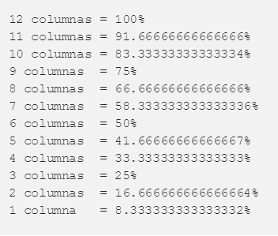
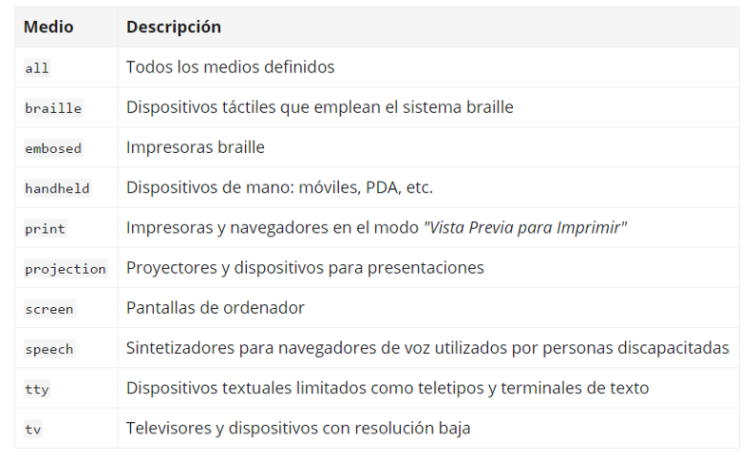

# **Grid System**

El grid system ayuda a alinear elementos de página basados ​​en columnas (columns) y filas (rows) secuenciadas.

### Elementos:
* *Container*: El objetivo es establecer el ancho de toda la grid, generalmente es del 100%, pero también es posible un ancho máximo para pantallas más grandes.

* *Row:* El propósito es evitar que las columns dentro de él se desborden en otras rows.

* *Columns:* El propósito es contener a los elementos que queremos mostrar en nuestro sitio web.

* *Gutters:* son los espacios entre las columns.

Se usa para dividir una página en pequeños y espaciados segmentos.

### Formula:

                  (n/12) * 100

 Las columnas del 1 al 12:

### Tipos de Grid

**La grilla manuscrita** es la grilla más básica, está hecha de un rectángulo que define los márgenes del formato.

**Una grilla de columnas,** está dividida en columnas y es el tipo de grilla más usada.

**La grilla modular**, conformada de columnas y filas que indica las ubicaciones x y en el eje y.

**grilla jerárquica** es una especie de cuadrículas que no encajan en las categorías anteriores y se describe por no tener el mismo espacio entre los módulos.

***
# **Media Queries**
Conformadas por Media Types, Media Features se ejecuta si las condiciones son verdaderas y se conectan por los  operadores logicos.

Los **media types** son los dispositivos donde se puede visualizar nuestro sitio web.

